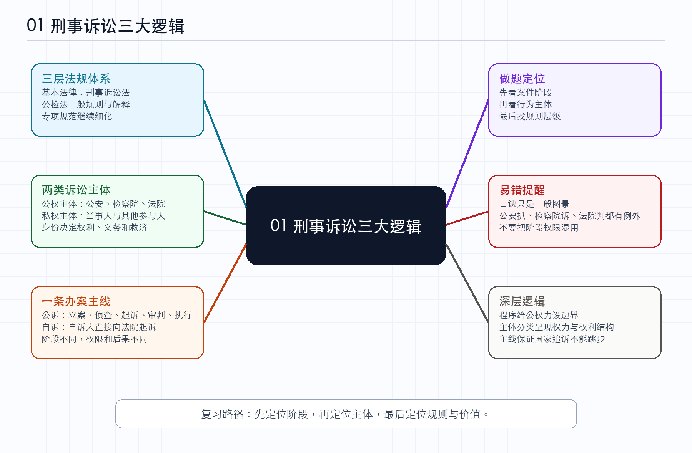

# 01-刑事诉讼三大逻辑_笔记

*图：刑事诉讼三大逻辑思维导图*

## 本节定位

这一节不是直接讲某个具体制度，而是先给刑事诉讼法建立入门框架。刑诉法是一门程序法，初学时容易觉得规则碎、机关多、阶段多、例外多，因此老师先用“三二一”把整门课的底层结构搭起来。所谓“三”，是三层法规体系；所谓“二”，是两类诉讼主体；所谓“一”，是一条办案主线。**后续所有细节，都可以回到这三个问题中定位：规则从哪里来，谁在程序中活动，案件沿什么路线推进。**

**思考。** 这一节真正重要的地方，不在于记住“三二一”这个口号，而在于意识到刑诉法不是平铺的知识表。刑诉法的题目经常把主体、阶段、权限、期限、救济和后果混在一起考，如果没有一个上位结构，做题时就只能靠零散记忆硬碰。三大逻辑的价值，是让每个规则都能被放回一个位置：它属于哪一层规范，约束哪个主体，发生在程序主线的哪一段。

## 三层法规体系

刑诉法相关规范很多，涉及法律、司法解释和其他规范性文件三十多部。入门时不应把它们看成杂乱材料，而应先按层级理解。第一层是《刑事诉讼法》这个基本法律。它覆盖从立案、侦查、起诉、审判到执行的完整过程，但由于条文数量有限，很多规定比较原则、概括，无法解决所有实践操作问题。

第二层是公检法围绕自身职责形成的一般规则或主要司法解释。公安机关主要负责侦查，因此有《公安机关办理刑事案件程序规定》来细化搜查、扣押、查封、冻结等侦查行为。检察机关主要负责审查逮捕、审查起诉、提起公诉和法律监督，因此有《人民检察院刑事诉讼规则》。人民法院主要负责审判，因此有最高人民法院关于适用刑诉法的解释。这一层可以理解为对刑诉法的第一次细化。

第三层是更具体的专项法规或专项解释。随着海上犯罪、网络犯罪、电子数据、认罪认罚、值班律师、人民陪审员等问题出现，原有的一般规则仍可能不够细，于是需要针对特殊问题作进一步规定。这一层可以概括为“细化的再细化”。所以刑诉法规体系不是同一平面上的堆叠，而是从基本法律，到一般规则，再到专项规则逐步展开。

**思考。** 三层法规体系对法考尤其重要，因为客观题不会只考《刑事诉讼法》本身。很多选项看起来像常识判断，实质上考的是司法解释或专项规范中的细化规则。如果只背基本法，遇到电子数据、认罪认罚、值班律师、海警办案、量刑建议等场景时就容易失分。更稳妥的复习方式，是先知道某类问题大致落在哪一层规范里，再去记常考规则。

## 两类诉讼主体

刑事诉讼中的主体很多，例如犯罪嫌疑人、被告人、被害人、证人、鉴定人、辩护人、诉讼代理人、法定代理人等。老师把它们先分为两大类：公权主体和私权主体。公权主体主要是国家专门机关，也就是公安机关、检察机关和人民法院。入门时可以用“公安抓，检察院诉，法院判”来记忆，但这只是简化框架，后续还要补充例外和细化分工。

私权主体主要是诉讼参与人，又可以分为当事人和其他诉讼参与人。当事人和案件处理结果有直接利害关系，刑事案件中最核心的是犯罪嫌疑人、被告人和被害人。犯罪嫌疑人、被告人可能因为案件结果失去自由、财产甚至生命，被害人则是犯罪行为直接侵害的对象。其他诉讼参与人通常是来辅助诉讼的人，例如法定代理人、证人、辩护人、诉讼代理人。他们参与程序，但通常不是案件实体结果的直接承受者。

区分当事人与其他诉讼参与人的关键，是看其是否与案件结果有直接利害关系。证人可能影响案件事实认定，但证人自己并不会因为被告人有罪或无罪而承担刑事责任；法定代理人可能维护未成年人的权益，但真正面临刑罚评价的是未成年人本人；辩护人和诉讼代理人都可能由律师担任，但辩护人服务于犯罪嫌疑人、被告人一方，诉讼代理人多服务于被害人一方。

**思考。** 主体分类看似简单，实则是后续很多制度的入口。管辖要问哪个机关管，回避要问哪个办案人员或参与者应当退出，辩护和代理要问服务哪一方，强制措施要问限制谁的权利，证据规则要问谁提供、谁质证、谁审查。刑诉法做题的第一步，往往不是背结论，而是先把题目里每个人的身份摆正。

## 一条办案主线

公诉案件的基本主线是立案、侦查、起诉、审判、执行。立案标志刑事诉讼活动正式启动；侦查的核心是收集证据、查明事实、抓获犯罪嫌疑人；起诉是检察院代表国家向法院提起公诉；审判由法院判断被告人刑事责任有无以及如何裁判；执行则使生效裁判落地。一般而言，公安机关负责立案和侦查，检察机关负责起诉，法院负责审判和执行，但这只是一般分工，后续专题会不断补充例外。

这条主线之外，还有许多贯穿各阶段的通用制度。例如管辖回答“谁有权管”，回避回答“有利害关系的人是否应退出”，辩护回答“犯罪嫌疑人、被告人如何维护自身权利”，证据回答“事实如何被证明”，强制措施回答“为保障诉讼进行可以如何限制人身自由”。这些制度不是脱离主线独立存在，而是在立案、侦查、起诉、审判等阶段反复发挥作用。

自诉案件的主线不同于公诉案件。自诉案件更接近“自己到法院告”，基本线索是自诉人向法院起诉，法院立案，进入审判，裁判生效后执行。它常见于轻微、熟人或亲属之间的刑事纠纷，是否追究刑事责任在特定案件中更依赖被害人的选择。老师提示，从法考复习权重看，自诉案件通常不如公诉案件主线重要，重点仍应放在公诉案件五步主线。

**思考。** 办案主线是刑诉法最强的“时间轴”。同一个制度放在不同阶段，答案可能不同。例如律师何时介入、证据何时移送、强制措施由谁决定、检察院如何监督、法院何时审查，都必须结合程序阶段判断。做题时如果只看到“公安、检察院、法院”而不看案件走到哪一步，就容易把不同阶段的权限混在一起。

## 用一句话统摄本节

刑事诉讼可以先理解为：两类主体依照三层法规体系，沿着一条办案主线，共同解决被告人刑事责任有无的问题。三层法规体系回答规则来源，两类诉讼主体回答谁在活动，一条办案主线回答案件如何推进。这个句子可以作为后续复习的总提纲。

**思考。** 刑诉法的核心矛盾，是国家追诉犯罪的公权力与个人权利保障之间的张力。三层法规体系是在给公权力运行提供规则，两类主体是在标明权力与权利的对抗结构，一条办案主线是在规定国家不能跳步、不能任意、不能脱离程序地实现惩罚。把这一点想清楚，很多看似机械的程序规则就不再只是“背诵负担”，而是限制权力、保障公正的制度安排。

## 法考提示

做刑诉题时，可以先用本节框架完成三次定位。一，定位程序阶段，判断题目发生在立案、侦查、起诉、审判还是执行。二，定位诉讼主体，判断行为来自公安、检察院、法院、当事人还是其他诉讼参与人。三，定位规则层级，判断题目是否只用基本法即可解决，还是涉及司法解释或专项规范。完成这三步后，再进入具体法条判断，错误率会明显下降。

本节最容易错的地方，是把入门口诀当成绝对规则。公安抓、检察院诉、法院判只是一般图景，不等于所有案件都由公安立案，也不等于检察院只起诉不监督，更不等于法院只能机械接受检察院指控。后续遇到自诉、监察衔接、检察机关自侦、审判监督、执行变更等内容时，都要在这个基础框架上补充例外。

## 复习回看

回看本节时，应当能用自己的话解释三件事。第一，为什么刑诉法规范要分成基本法律、一般规则和专项规范三个层级。第二，为什么诉讼主体要先分公权主体与私权主体，再区分当事人与其他诉讼参与人。第三，为什么公诉案件主线是立案、侦查、起诉、审判、执行，而自诉案件不能机械套用同一条路线。能解释这三点，才说明本节不是记住了口号，而是真正建立了刑诉法入门地图。
