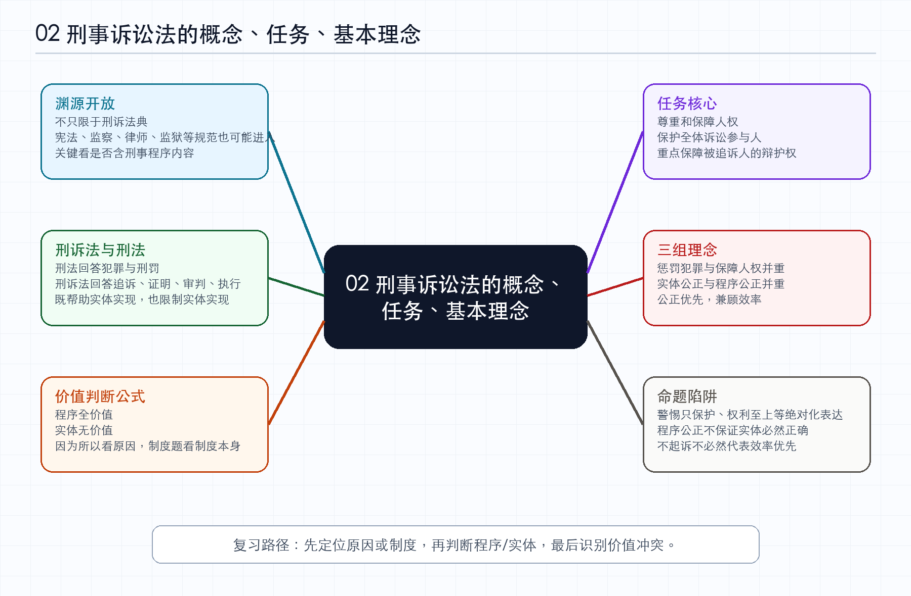

# 02-刑事诉讼法的概念、任务、基本理念_笔记

*图：刑事诉讼法的概念、任务、基本理念思维导图*

> 来源为众合左宁 2026 年法考客观题刑诉法精讲卷第二节“刑事诉讼法的概念、任务、基本理念”。本文根据音频转写整理，已经对 ASR 误识别的刑诉法、刑法、追诉时效、非法证据排除、附条件不起诉等术语作规范化校正。本文是学习笔记，不是逐字稿。

## 本节定位

本节进入第一编专题一的基础概述部分。刑事诉讼法的概念本身不太会直接考，但渊源、刑诉法与刑法的关系、任务和基本理念都有固定命题方式。老师特别提示，教材里的星级不是装饰。一星代表考过，二星代表常考，三星代表高频重点；但刑诉法不是每个点都要死背，更多时候要理解背后的理论和逻辑。

**思考。** 基础理论部分容易被低估，因为它不像管辖、强制措施那样有大量硬规则。但法考喜欢把理论点包装成判断题，尤其考“某个制度体现什么价值”“某个表述是否过度绝对”。因此，这类内容的复习重点不是背概念定义，而是提炼可操作的判断公式。

## 刑诉法的渊源

刑诉法的渊源，是刑事诉讼法律规范的存在形式。通俗地说，只要某部法律、法规、解释或规定中包含刑事诉讼程序内容，或者提到了刑诉法相关规则，它就可能成为刑诉法渊源。宪法中有尊重和保障人权、公民不受非法逮捕等内容，涉及强制措施和权利保障，所以可以成为刑诉法渊源。监察法、监狱法、律师法等规范中，只要存在刑事程序衔接、诉讼权利或办案权限的内容，也可能属于刑诉法渊源。

考试不要求把所有渊源完整背下来，更重要的是看到常见规范名称时能判断它是否可能包含刑事诉讼程序。老师点到的重点包括宪法、刑诉法、律师法、刑法、监察法、监狱法、监察官法、刑诉解释、高检规则、公安部规定等。判断时不要被部门法名称限制住，只要其中含有刑事诉讼程序内容，就有进入渊源范围的可能。

**思考。** “渊源”这个点背后反映的是刑诉法的开放性。刑诉法不是一本法典就能封闭解决全部程序问题，它会与宪法、监察、律师、监狱、公安、检察、法院解释等规范发生连接。对复习而言，渊源意识意味着遇到新型题目时不要只问“刑诉法条文有没有”，还要问“相关司法解释或专项规范有没有”。

## 刑诉法与刑法的关系

刑法是实体法，回答什么行为构成犯罪、构成什么罪、应当判什么刑；刑诉法是程序法，回答如何追诉、如何证明、如何审判、如何执行。刑诉法对刑法既有工具价值，也有独立价值。工具价值是指刑诉法帮助刑法从纸面规范变成现实裁判，例如通过立案、侦查、起诉、审判和执行，让定罪量刑真正落地。独立价值是指程序正义本身具有独立意义，刑诉程序不仅服务实体法，也可能限制实体法实现。

独立价值的典型表现，是即使实体结论看似正确，只要程序严重违法，也可能导致案件被发回重审；非法证据被排除后，案件可能事实不清、证据不足，最终不起诉或无罪；只有被告人一方上诉时，二审不得加重被告人刑罚。老师用一句话概括：刑诉法一方面帮助刑法实现，另一方面也制约刑法实现。

**思考。** 工具价值和独立价值的区分，是刑诉法价值观的入口。刑诉法如果只有工具价值，就会变成单纯打击犯罪的流水线；如果承认独立价值，就意味着程序本身可以成为评价案件正当性的标准。法考考这个点，实质是在考你是否理解程序法不是实体法的附庸。

## 工具价值和独立价值的判断公式

这一部分是本节核心。题目通常有两种结构。第一种是“因为所以结构”，例如因为排除非法证据，所以证据不足不起诉；第二种是“某一制度结构”，例如问未成年人刑事案件特别程序是否体现刑诉法价值。前者重点看原因，后者重点看制度本身。

老师给出的公式是：程序全价值，实体无价值。也就是说，如果原因或制度属于刑诉法中的程序制度，就既可能体现工具价值，也可能体现独立价值；如果原因或制度属于刑法中的实体制度，就不能说体现刑诉法的工具价值或独立价值。非法证据排除、证明标准、回避、管辖、上诉、二审、刑事和解程序、未成年人特别程序、最高检核准追诉，都偏向程序制度；定罪、量刑、自首、立功、此罪彼罪、追诉时效，则是刑法实体制度。

因为排除非法证据，所以证据不足不起诉。这个题的原因是非法证据排除，排非属于刑诉程序，因此可以体现刑诉法的工具价值或独立价值。因为重大立功，所以量刑从轻。这个题的原因是立功，立功属于刑法实体制度，因此不体现刑诉法工具价值或独立价值。为未成年人设置特别刑诉程序，问的是制度本身，而该制度属于刑诉程序，因此可以体现刑诉法价值。超过追诉时效的案件经最高检核准后仍可追诉，不能把原因看成“过了时效”，真正的程序原因是“经最高检核准”，因此可以体现刑诉法价值。

**思考。** 这个公式的真正用处，是把抽象价值题变成定位题。考试不一定直接问“程序还是实体”，而会给一个故事。只要你能抓住故事里的原因或制度，再判断它来自刑诉法还是刑法，就能绕开大段理论表述。这里最容易错的是被结果牵着走，例如看到“从轻处罚”就以为和量刑有关而排除，实际上若原因是刑事和解程序，仍可能体现程序价值。

## 刑诉法与法治国家

刑诉法的相关条款，是对宪法原则和法治精神的具体化。宪法要求尊重和保障人权、规范国家权力运行，刑诉法通过具体程序、权利保障和机关职责把这些原则落到刑事案件办理中。这个点以熟悉为主，考试一般考原话或接近原话的判断。

**思考。** 这一点可以和第一节的三层法规体系联动理解。宪法提供最高层面的价值和原则，刑诉法把它转化为可操作的程序规则，司法解释再把程序规则细化到办案场景。由上至下看，是价值具体化；由下至上看，是程序规则获得正当性的来源。

## 刑诉法的任务

刑诉法第二条内容较长，本节抓住核心词：尊重和保障人权。这里的“人权”不能狭隘理解为只保障犯罪嫌疑人、被告人。刑诉法保障的是全体诉讼参与人及相关公民的人权，包括犯罪嫌疑人、被告人、被害人、证人、鉴定人以及其他在刑事程序中可能受影响的人。因此，“只保障嫌疑人、被告人”或“嫌疑人、被告人权利至上”的表述通常错误。

但这不意味着犯罪嫌疑人、被告人的权利没有特殊重要性。在刑事诉讼实践中，犯罪嫌疑人、被告人最容易面临强制追诉、刑讯逼供、权利受限等风险，因此其辩护权更紧迫、更需要重点保障。老师的表达是，嫌疑人、被告人的权利很紧急，但并不高贵。换言之，在保障全体诉讼参与人权利的前提下，重点保障嫌疑人、被告人的辩护权是正确的；但说其权利至高无上或只保护这一方，是错误的。

**思考。** 这个考点的本质是“平等保护”和“重点保护”的关系。平等保护回答保护范围，重点保护回答风险强度。刑事追诉天然带有国家强制性，被追诉人处于更危险的位置，所以需要重点保护；但刑诉法同时也要保护被害人、证人和其他参与人的权利，不能把被追诉人的权利绝对化。

## 刑事诉讼的基本理念

本节讲了三组理念。第一组是惩罚犯罪与保障人权，二者都重要，不能只强调打击犯罪，也不能只强调权利保护。第二组是实体公正与程序公正，实体公正强调查清事实、正确适用法律、准确进行定罪量刑，程序公正强调办案过程公平、公开、规范、受约束。程序公正能够最大限度保障实体公正，但不能说只要程序公正，实体就一定公正。第三组是效率与公正，二者都需要，但发生冲突时不是简单并重，而是公正优先、兼顾效率。

程序公开透明有助于发挥程序约束作用。程序和法条可以被了解、查询和适用时，诉讼参与人可以利用程序维护权利，办案机关也会被程序规则规制。但程序约束不等于所有违法取得的证据都必须排除。严重违法的非法证据应当依法排除，轻微违法或有瑕疵的证据则可能通过补正或合理解释继续使用。简易程序、速裁程序可以提高效率，但不意味着证明标准降低，也不意味着程序约束变弱。

效率与公正的关系要结合制度目的判断。轻罪不起诉使案件不再进入审判程序，体现效率价值；未成年人附条件不起诉设置考验期，可能拉长程序、降低效率，但更重视未成年人保护和人权保障。因此不能看到“不起诉”就一律判断为提高效率。

**思考。** 三组理念不是三句政治口号，而是后续制度冲突的裁判尺度。非法证据排除体现程序公正可能牺牲打击犯罪，速裁程序体现效率但不能牺牲公正，附条件不起诉牺牲效率换取未成年人保护。法考喜欢考这些价值冲突，因为它能检验你是否理解制度为什么存在。

## 法考提示

遇到渊源题时，先看该规范是否包含刑事诉讼程序内容，不要只盯《刑事诉讼法》本身。遇到工具价值和独立价值题时，先识别是因为所以结构还是某一制度结构；如果是因为所以结构，就看原因；如果是制度结构，就看制度本身。原因或制度属于程序，通常既体现工具价值也体现独立价值；原因或制度属于实体，就不体现刑诉法的这两种价值。

遇到人权保障题时，要警惕绝对化表达。“只保护嫌疑人、被告人”“权利至上”通常错误；“在保障全体诉讼参与人权利的前提下，重点保障嫌疑人、被告人的辩护权”通常正确。遇到基本理念题时，要警惕“只要……就一定……”这种充分条件式表达。程序公正能保障实体公正，但不保证实体必然正确；简易程序和速裁程序能提高效率，但不削弱程序约束；违法取证不必然全部排除，要区分非法证据与瑕疵证据。

## 复习回看

回看本节时，应当能解释四个问题。第一，为什么宪法、监察法、律师法等规范也可能成为刑诉法渊源。第二，为什么刑诉法既是刑法实现的工具，又有独立限制实体法的价值。第三，为什么“程序全价值，实体无价值”能够解决工具价值和独立价值题。第四，为什么人权保障既不能限缩为只保护被追诉人，也不能否认被追诉人辩护权的优先保护意义。
