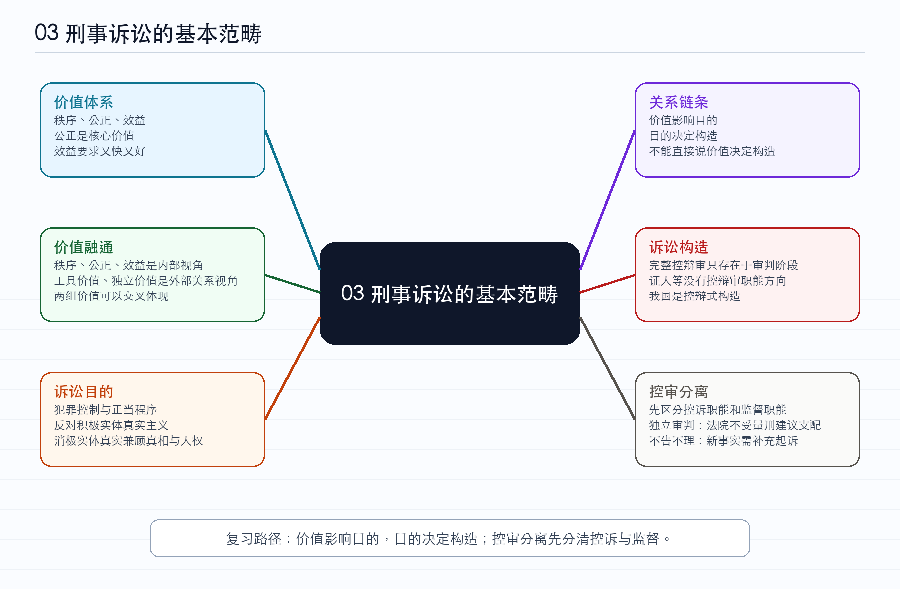

# 03-刑事诉讼的基本范畴_笔记

*图：刑事诉讼的基本范畴思维导图*

> 来源为众合左宁 2026 年法考客观题刑诉法精讲卷第三节“刑事诉讼的基本范畴”。本文根据音频转写整理，已经对 ASR 误识别的刑诉法、刑法、控辩审、职权主义、当事人主义、控审分离等术语作规范化校正。本文是学习笔记，不是逐字稿。

## 本节定位

本节讲刑事诉讼的基本范畴，也就是后续制度学习中会反复出现的基础概念。核心内容可以压缩为三个关键词：价值、目的、构造。价值回答刑事诉讼追求什么，目的回答这种追求要导向什么制度目标，构造回答控方、辩方、审判方在程序中如何分工和互动。老师明确提示，刑事诉讼构造是本章概述部分的核心重点。

**思考。** 这一节比前两节更抽象，但它不是纯理论。刑诉法的很多具体制度，例如强制措施、非法证据排除、审判中立、控辩平等、检察院抗诉、法院补充起诉建议，都可以从价值和构造中找到解释。法考考基本范畴，往往不是考定义，而是考你能不能把一个具体制度放回价值目的构造的链条中判断。

## 刑事诉讼价值

刑事诉讼价值有三个表层维度：秩序、公正和效益。秩序价值包括维护社会秩序、使惩罚犯罪本身有序进行、使刑事司法权的行使受到刑事程序规范。简化理解就是社会要有序，办案本身也要有序，国家机关必须按法定程序办事。

公正价值是核心价值。老师强调，公正在刑事诉讼价值中是老大，离开公正，其他价值就失去意义。公正可以通过比例原则体现。比例原则可以通俗理解为“见人下菜碟”，也就是措施轻重要与案件严重程度、嫌疑人危险性、经济条件等因素相匹配。犯罪情节轻、危险性小的人，可以适用取保候审、监视居住等较轻措施；杀人、抢劫等严重犯罪且危险性高的人，则可能适用拘留、逮捕等更强的限制措施。轻者用轻措施，重者用重措施，才符合公平公正。

效益价值不只是速度快，还要求又快又好。刑事诉讼需要在有限司法资源中处理大量案件，所以效率有意义；但这种效率不能脱离公正，否则只是粗糙地压缩程序。

**思考。** 秩序、公正、效益这三个价值并不是同等地位。公正是核心，秩序和效益要围绕公正展开。秩序如果脱离公正，会变成机械服从；效益如果脱离公正，会变成快速处理而不管正误。后续学习简易程序、速裁程序、强制措施时，都要记住效率和秩序不能吞掉公正。

## 价值之间的融通关系

刑事诉讼价值还有一个深层考法。刑事诉讼自身有秩序、公正、效益三个价值；从刑诉法与刑法的关系看，又有工具价值和独立价值。两组价值不是割裂的，而是相互融通。工具价值可以体现秩序、公正、效益，独立价值也可以体现秩序、公正、效益；反过来说，秩序、公正、效益也都可以在工具价值和独立价值中体现。

因此，如果题目说“效益价值只属于工具价值，不属于独立价值”，或者说“秩序价值体现工具价值但不体现独立价值”，通常就是错误的。正确理解是，不同价值只是观察角度不同，而不是彼此排斥。

**思考。** “相互融通”这个点之所以容易考，是因为考生会把概念表格机械化。表面看，秩序、公正、效益是一组，工具价值、独立价值是另一组，于是误以为它们互不相干。实际上，工具价值和独立价值是在问刑诉法相对于刑法有什么作用，秩序、公正、效益是在问刑事诉讼自身追求什么状态。一个是外部关系视角，一个是内部价值视角，当然可以交叉。

## 刑事诉讼目的

刑事诉讼目的部分以熟悉为主。课程中提到犯罪控制模式与正当程序模式、家庭模式，以及实体真实主义与正当程序主义。考试重点曾落在实体真实和正当程序上。

实体真实主义又可以区分为积极实体真实主义和消极实体真实主义。积极实体真实主义强调实体真实优于程序，人权保障让位于实体真实，违反程序也可能不影响后续效果。这种立场容易导致为了查清事实而无所不用其极，甚至发生刑讯逼供等违法取证，因此不可取。消极实体真实主义则相对折中，既追求发现案件真相，又力求避免处罚无辜，强调在查清事实的同时尊重程序和保障人权。

如果题目表述为“司法机关注重发现案件真相，是为了防止无辜者被错误定罪”，更接近消极实体真实主义。它不是不追求事实真相，而是不允许为了事实真相牺牲基本程序和无辜者保护。

**思考。** 实体真实和正当程序的关系，是刑诉法中的长期拉扯。刑事案件当然要查清事实，但查清事实不能成为突破程序底线的理由。越是严重案件，社会越希望迅速发现真相，也越容易容忍程序让步；法治程序的意义，正是在这种压力下仍然要求国家按规则行使权力。

## 价值目的构造的关系

刑事诉讼构造与价值、目的之间的关系可以用一句话概括：价值影响目的，目的决定构造。一个国家对刑事诉讼价值的理解，会影响其制定刑事诉讼法的目的；目的进一步决定它采取什么样的诉讼构造。不能直接说“价值决定构造”，因为中间还有目的这一层。

老师用法考复习作类比。一个人追求自由、梦想、尊严，这是价值；为了实现这些价值，选择通过法考，这是目的；至于先听课再做题，还是先做题再听课，是复习结构或构造。价值会影响你设定什么目标，目标才决定你采取什么结构。把这个类比放回刑诉法，就是价值先影响目的，目的再决定构造。

**思考。** 这个链条能帮助理解为什么不同国家诉讼构造不同。一个制度若更重视犯罪控制和实体真实，容易强化法官或国家机关职权；若更重视程序正义和人权保障，容易强化控辩对抗和审判中立。构造不是凭空设计出来的，它是价值选择通过目的转化后的制度形态。

## 刑事诉讼构造

刑事诉讼构造，是控方、辩方、审判方三方之间的关系、地位和作用。控方通常负责指控，辩方负责辩护，审判方居中裁判。完整的控辩审三方构造只存在于审判阶段，因为只有审判阶段才同时存在控方、辩方和审判方。审前阶段主要存在控辩关系，没有真正居中裁判的审判方。

这点容易被题目误导。题目可能说审查起诉阶段检察官居中审查，公安机关相当于控方，犯罪嫌疑人相当于辩方，所以也存在控辩审构造。这个说法错误。检察官在审前可以监督和制约，但不是审判方；只有法院法官才有审判权。审前阶段没有完整控辩审结构。

**思考。** “完整构造只存在于审判阶段”体现了审判中心的基本逻辑。侦查和起诉阶段虽然也有对抗和审查，但还没有一个真正中立裁判者来终局判断事实和法律。只有进入审判，控辩双方的主张才面对一个居中裁判的审判方，控辩审三角才完整形成。

## 控辩审三方职能

控诉职能一般由检察院承担，但自诉案件中自诉人也承担控诉职能。公诉案件中的被害人虽然主要控诉职能被检察院代表和吸收，但并不意味着被害人完全没有控诉职能。被害人仍然可以辅助公诉人参与诉讼活动，因此可以说被害人在公诉案件中承担辅助的控诉职能。

辩护职能主要由犯罪嫌疑人、被告人及其辩护人承担。审判职能由法院承担。证人、见证人、鉴定人、翻译人不具有控辩审任何一方的职能方向。他们的任务是客观协助查明案件事实或保障程序沟通，而不是帮助控方或辩方获胜。即使某个证人是公诉人申请出庭的，也不能说该证人履行控诉职能；即使证人由辩护人申请出庭，也不能说该证人履行辩护职能。

**思考。** 证人没有控辩方向，是证据制度客观性的基础。现实中证人可能对控方有利，也可能对辩方有利，但这只是证言内容的效果，不是证人身份的职能。法考在这里考的不是生活经验，而是诉讼角色的制度定位。

## 主要诉讼构造类型

当今世界主要有当事人主义、职权主义和混合式三类构造。当事人主义盛行于英美法系，以英国、美国为代表，强调控辩双方推动庭审，法官相对消极被动。它有利于控辩平等对抗和程序正义，但可能降低效率，因为庭审节奏更依赖双方攻防。

职权主义盛行于大陆法系，以德国、法国为代表，强调法官职权，法官是庭审指挥者。它有利于提高效率、保证裁判专业性和查清事实，但也可能导致控辩双方发言和对抗不够充分，不利于当事人权利保障。

混合式不是把当事人主义和职权主义随便相加。课程中特别强调，它是特指日本、意大利这类国家的构造，历史上先吸收德国式职权主义，后来再吸收美国式当事人主义因素，形成以当事人主义为主、以职权主义为辅的结构。题目如果说“当事人主义吸收职权主义形成混合式”，或者泛泛说“两者一混就是混合式”，要警惕错误。

**思考。** 三种构造背后其实是价值排序不同。当事人主义更强调控辩平等和程序正义，职权主义更强调法官查明事实和程序效率。混合式说明现实制度很少完全纯粹，很多国家会在权利保障和事实发现之间寻找折中。理解这一点，比单纯背“英美、大陆、日本意大利”更有用。

## 我国的控辩式构造

我国不直接称为当事人主义、职权主义或混合式，而是控辩式诉讼构造。控辩式的基本含义是弱化法官职权指挥色彩，强化控辩双方平等对抗，同时要求法官居中裁判。具体表现为审判中立、控审分离、控辩平等对抗。

不论公诉案件还是自诉案件，都属于我国控辩式诉讼构造。不能因为自诉案件是自诉人告被告人，就说它属于当事人主义。我国控辩式构造仍处于发展完善阶段，并且是开放体系，可以吸收当事人主义或职权主义中的合理因素。例如法院庭前阅卷可能体现职权主义色彩，非法证据排除规则可能借鉴英美法系制度，但这不等于我国就是职权主义或当事人主义。

**思考。** “有某种色彩”不等于“属于某种主义”。这是法考常见陷阱。我国制度可以借鉴某些域外制度的具体规则，但整体构造名称和基本定位仍然是我国自己的控辩式。做题时要区分局部制度特点和整体构造归属。

## 控审分离

控审分离是本节难点。要理解它，先要区分检察院的控诉职能和监督职能。检察院有侦查权、公诉权和法律监督权，其中侦查权与公诉权合起来才属于控诉职能。控诉的核心是求刑，也就是请求法院定罪量刑；监督的核心是纠错，也就是发现公安或法院的行为、裁判有问题并要求纠正。控审分离中的“控”，说的是控诉职能，不是监督职能。

审判权由法院行使。法院审判权有两层含义。第一是独立审判，检察院控什么、建议判几年，并不能直接决定法院怎么判。检察院指控抢夺，法院经审理认为构成抢劫，可以依法改判抢劫；检察院建议判三年，法院认为应判十年，也可以依法裁判。第二是不告不理，没有指控就没有审理，告什么就审什么。检察院不提起公诉，法院不能主动开庭审案；检察院只指控盗窃，法院不能在没有补充起诉的情况下直接就新发现的诈骗事实定罪处罚。

独立审判和不告不理并不矛盾。关键看有没有新事实。如果检察院指控的事实是同一件事，只是检察院认为是抢夺，法院认为是抢劫，这是同一事实的法律评价不同，法院可以独立改判。如果检察院只指控盗窃，法院另发现诈骗，这是新事实或新罪，已经超出指控范围，法院不能直接裁判，只能建议检察院补充起诉。

**思考。** 控审分离本质上是在防止控诉权和审判权互相吞并。检察院不能命令法院怎么判，否则审判权会被控诉权支配；法院也不能越过检察院指控范围主动追诉新事实，否则审判权会反过来侵入控诉权。控审分离不是让两者互不沟通，而是要求沟通以建议方式进行，最终决定仍由各自权力主体作出。

## 控审分离的做题方法

判断一个案例是否体现控审分离，可以两步走。第一步，看是否真的是控审关系，也就是是否涉及检察院请求法院定罪量刑的控诉权与法院审判权之间的关系。如果检察院抗诉只是为了纠正一审错误，或者建议法院变更强制措施，体现的是法律监督权，不是控诉权，就不能说是控审分离。第二步，如果确实是控审关系，再看是否分离。检察院可以建议法院从轻或从重，但不能命令法院；法院发现新事实可以建议检察院补充起诉，但不能直接对未被指控的新事实裁判。

检察官认为被告人认罪认罚、态度较好，建议法院判三年而不是五年，这是求刑，属于控诉职能；检察院只是提出量刑建议，最终判几年由法院决定，因此体现控审分离。检察院认为一审判三年太轻而抗诉，引起二审，这是请求二审纠正一审错误，体现的是监督职能，不是控诉职能，因此不体现控审分离。检察院只指控盗窃，法院发现还有诈骗并直接数罪并罚，虽然存在控审关系，但法院没有遵守告什么审什么，反而干涉了公诉权，因此不符合控审分离。

**思考。** 这个考点的难处，是“检察院行为”不都等于“控诉”。检察院在刑诉中有多重身份：它可以侦查、可以公诉、可以监督。题目一出现“检察院建议、检察院抗诉、检察院审查”，就要先问它此刻是在求刑，还是在纠错。只有求刑才进入控审分离的判断通道。

## 本章概述的整体逻辑

老师最后用“一个人”来总结第一章概述。这个人首先有人权保障的问题，也就是刑诉法要保障全体诉讼参与人的人权，同时重点保障嫌疑人、被告人的辩护权。这个人还要有理念，也就是惩罚犯罪与保障人权并重，实体公正与程序公正并重，效率与公正冲突时公正优先、兼顾效率。这个人还要有追求，包括刑事诉讼价值、刑事诉讼目的和刑事诉讼构造。

价值一体两面。从刑事诉讼自身看，有秩序、公正、效益，其中公正是核心价值；从刑诉法与刑法的关系看，有工具价值和独立价值，两组价值相互融通。目的部分重点理解消极实体真实主义比积极实体真实主义更合理，因为它在追求事实真相的同时尊重人权和程序。构造部分是本章核心，必须掌握价值影响目的、目的决定构造，完整控辩审只存在于审判阶段，以及我国控辩式构造中的控审分离。

## 法考提示

本节做题要特别注意几类表述。说公正是刑事诉讼价值的核心地位，通常正确；说秩序价值包括规范国家刑事司法权行使，通常正确；说效益价值只属于工具价值而不属于独立价值，通常错误，因为两组价值相互融通；说适用强制措施应遵循比例原则，通常是在考公正价值。

构造题要警惕三个陷阱。第一，价值不能直接决定构造，应当是价值影响目的、目的决定构造。第二，完整控辩审构造只存在于审判阶段，审前阶段没有审判方。第三，控审分离必须先是控诉与审判的关系，再看是否分离；如果题目体现的是检察院监督权，就不要套控审分离。

## 复习回看

回看本节时，应当能解释六个问题。什么是秩序、公正、效益，为什么公正是核心价值；为什么秩序、公正、效益与工具价值、独立价值是相互融通关系；为什么消极实体真实主义比积极实体真实主义更合理；为什么价值只能影响目的、不能直接决定构造；为什么完整控辩审构造只存在于审判阶段；为什么控审分离要先区分控诉职能和监督职能。
