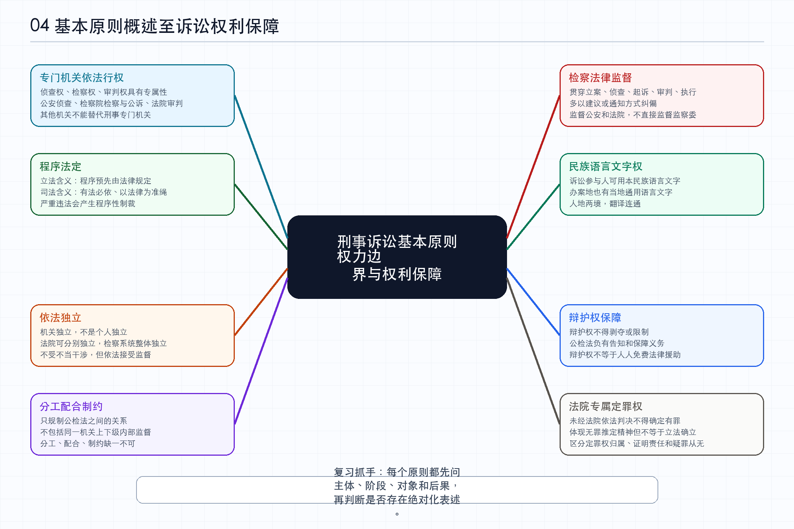

# 04-基本原则概述-保障诉讼参与人的诉讼权利_笔记

*图：基本原则概述至保障诉讼参与人的诉讼权利思维导图*

> 来源为众合左宁 2026 年法考客观题刑诉法精讲卷第四节“基本原则概述-保障诉讼参与人的诉讼权利”。本文根据音频转写整理，已经对 ASR 误识别的刑诉法、侦查权、检察权、审判权、程序法定、诉讼参与人等术语作规范化校正。本文是学习笔记，不是逐字稿。

## 本节定位

本节进入刑事诉讼法基本原则专题，覆盖从基本原则概述到保障诉讼参与人的诉讼权利这十个小节。老师开头提示，整个基本原则部分看起来原则很多，但命题权重并不平均。认罪认罚从宽和具有法定情形不予追究刑事责任是后续更高频的重点，本节涉及的原则多数以熟悉理解为主，不过其中程序法定、分工配合制约、语言权、辩护权、法院专属定罪权等仍有稳定考法。

**思考。** 基本原则不是口号，而是刑诉法具体制度的上位控制器。后续学习管辖、回避、辩护、证据、强制措施和审判程序时，常常会遇到两个方向的冲突：一边是国家追诉犯罪需要效率和权威，另一边是个人权利需要限制国家权力。基本原则的价值就在于先划出边界，告诉我们哪些权力只能由谁行使，哪些程序不能省略，哪些权利不能被当成办案成本随意压缩。

## 基本原则的入口

刑事诉讼基本原则具有较强的法理基础，体现刑事诉讼运行的基本规律，并且通常有明确法律规定和法律约束力。这个部分本身不需要大量背诵，理解为后续具体制度的总纲即可。考试曾经考过特点的原文，因此复习时至少要能识别“有深厚法理基础”“体现基本规律”“有法律明确规定”“具有法律约束力”等表述。

**思考。** 原则题的难点不在于文字抽象，而在于它经常被放到案例里。一个选项如果只是在重复原则名称，通常不难；真正容易错的是题目把原则放进具体机关、具体阶段、具体诉讼身份中，让你判断这个原则到底能不能覆盖该场景。因此复习基本原则时，不要只记名称，要同时记住主体、阶段、对象和法律后果。

## 专门机关依法行使职权

侦查权、检察权和审判权由专门机关依法行使。这里首先强调职权的专属性和排他性。侦查、起诉和审判不是任何机关都能做，公安机关主要负责侦查，人民检察院负责检察和公诉，人民法院负责审判。教育局、商务部门等其他机关即使发现问题，也不能直接行使刑事侦查、起诉或审判权。

这个原则还强调明确分工和依法行使。各专门机关在办理刑事案件时各司其职，不能相互替代；同时必须按照刑事诉讼法和相关法律规定行使职权，不能因为打击犯罪的目的正当，就跳过法定权限或法定程序。

**思考。** 这一原则的深层意义，是把国家追诉犯罪的权力拆分给不同机关。刑事诉讼中的国家权力很强，如果侦查、起诉、审判集中在同一主体手中，就容易从“追诉犯罪”滑向“先定结论再找程序”。专门机关依法行使职权，既是办案效率分工，也是防止权力集中失控的制度安排。

## 严格遵守法律程序

人民法院、人民检察院和公安机关进行刑事诉讼，必须严格遵守刑事诉讼法和有关法律规定。办案应当以事实为根据、以法律为准绳，严重违反程序时还要承担相应程序后果。例如一审法院程序严重违法，二审法院可能撤销原判、发回重审；公安机关非法取证，相关证据可能被依法排除。这类后果可以理解为程序性制裁。

严格遵守法律程序也被称为程序法定原则。它有两层含义。作为立法原则，它要求法律预先规定刑事诉讼程序，让办案机关和诉讼参与人有法可依。作为司法原则，它要求法律已经规定之后，司法机关在具体办案中有法必依、执法必严，按照法定程序推进诉讼。

程序法定原则并不限于大陆法系。大陆法系有成文法，当然要遵守法定程序；英美法系虽然重视判例法，但判例法同样是法律的一种形式，所以也要遵守程序法定。考试如果说英美法系实行判例制度，所以不实行程序法定，就是错误表述。

**思考。** 程序法定最容易被误解成“法律技术问题”。实际上，它是在回答国家凭什么能够限制人的自由、财产和名誉。刑事程序越强制，越需要预先公布的规则来约束国家机关；否则办案机关就可能根据个案需要临时创造程序。程序法定的本质，是把追诉权从临时意志拉回公开规则。

## 依法独立行使职权

人民法院、人民检察院依法独立行使职权。这里的独立主体是机关，不是个人。我国强调人民法院独立行使审判权、人民检察院独立行使检察权，而不是法官个人独立或检察官个人独立。

独立的根据是宪法、刑事诉讼法和相关法律。独立的对象主要是不受行政机关、社会团体和个人干涉。但这不意味着法院、检察院不受任何监督，也不意味着脱离党的领导、人民监督或舆论监督。依法独立与依法接受监督并不冲突。

法院和检察院的独立方式还要结合上下级关系理解。上下级法院之间是监督与被监督关系，因此可以说某一法院依法独立行使审判权。上下级检察院之间是领导与被领导关系，因此通常不能说某一区检察院独立于上级检察院行使检察权，而应理解为检察系统整体依法独立行使检察权。

**思考。** 依法独立不是让司法机关成为孤岛，而是防止案件裁判和检察活动被不应介入的外部力量支配。它保护的是法律判断的独立空间，不是个人任性办案的自由空间。因此，判断题中如果把“依法独立”扩大成“不受任何监督”，或者缩小成“法官个人独立”，都偏离了这一原则。

## 分工负责互相配合互相制约

人民法院、人民检察院和公安机关进行刑事诉讼，应当分工负责、互相配合、互相制约，以保证准确有效地执行法律。分工负责强调各司其职，不能相互推诿或越权替代；互相配合强调程序衔接和相互支持；互相制约强调检察院对侦查活动的审查监督、法院通过审判对侦查和起诉阶段证据进行最终审查判断。

考试通常从三个角度考这个原则。第一个角度，是区分分工、配合和制约的概念。同一行为可能同时体现分工和配合。例如犯罪嫌疑人在侦查阶段拒绝认罪认罚，案件移送审查起诉后，检察院继续开展认罪认罚工作，既体现公安和检察院在不同阶段的分工，也体现程序推进中的配合。

第二个角度，是这个原则规制的是公检法之间的关系，不包括同一机关内部上下级之间的关系。二审法院撤销一审判决、发回重审，体现上级法院对下级法院的审判监督，但不是这里所说的公检法之间分工配合制约。

第三个角度，是这个原则的主体只能是人民法院、人民检察院和公安机关。司法行政机关向办案机关派驻值班律师或提供法律援助服务，可能体现权利保障或法律援助制度，但不能说体现公检法之间的分工配合制约。

**思考。** 分工、配合和制约三者必须同时存在。只有分工没有配合，案件会在机关之间断裂；只有配合没有制约，容易形成追诉共同体，弱化对权力的审查；只有制约没有配合，程序可能低效甚至互相掣肘。刑诉法追求的不是某一机关单独高效，而是在分工基础上的协同，以及在协同中的权力约束。

## 检察院法律监督

人民检察院依法对刑事诉讼实行法律监督。监督的阶段贯穿刑事诉讼各个阶段，包括立案、侦查、起诉、审判和执行。监督的性质通常表现为提出建议或通知，而不是直接以决定、命令、要求的方式替代其他机关办案。

监督对象主要是公安机关的侦查活动和人民法院的审判活动。课程中特别提示，检察院不能直接对监察委员会的调查活动实行法律监督。监察委员会办理职务犯罪调查时，检察院不能主动介入指导调查；如果监察委员会商请检察院介入，检察院可以介入，但这不同于检察院主动监督监察委员会。

监督时间也要细分。一般而言，刑事诉讼活动启动后才进入监督轨道。公安机关在侦查工作中可以请检察院介入侦查、指导取证；但在立案前的审查研究阶段，公安机关通常不能请检察院提前介入指导是否立案。另一个例外是，如果检察院发现公安机关应当立案而不立案，可以依法进行立案监督。

**思考。** 检察监督不是“更高一级办案权”，而是纠偏权。它的功能是防止侦查权和审判权偏离法律，而不是把公安或法院的判断完全替换为检察院判断。理解这一点，才能解释为什么检察院可以监督公安、监督法院，却不能在任何阶段、对任何机关、以任何方式发号施令。

## 各民族公民使用本民族语言文字

各民族公民都有使用本民族语言文字进行诉讼的权利。人民法院、人民检察院和公安机关对不通晓当地通用语言文字的诉讼参与人，应当为其提供翻译。在少数民族聚居或者多民族杂居地区，应当用当地通用语言进行审讯，用当地通用文字发布判决书、布告和其他文件。

这个原则的做题口诀可以概括为“人地两境，翻译连通”。“人”指诉讼参与人本人是什么民族、习惯使用什么语言文字；“地”指案件办理地的当地通用语言文字。人和地都要尊重，如果双方语言不通，就通过翻译连通。

因此，汉族人在拉萨涉嫌犯罪，不能简单说拉萨警方应当用汉语讯问；少数民族证人参加诉讼，也不能简单说法官应当用该少数民族语言询问。正确判断要同时看诉讼参与人的语言权利和办案地的当地通用语言，再看是否需要翻译。

**思考。** 语言权不是礼貌问题，而是程序参与能力问题。一个人如果听不懂讯问、看不懂文书、不能准确表达意思，就无法真正行使辩护、陈述、申诉、质证等权利。但刑事诉讼也不是完全以个人语言为中心，还要维持办案地司法活动的统一运行。因此“人地两境，翻译连通”本质上是在个人参与权和地方司法秩序之间做平衡。

## 犯罪嫌疑人被告人有权获得辩护

犯罪嫌疑人、被告人有权获得辩护，辩护权是其最核心、最基本的诉讼权利，不得以任何形式剥夺或限制。人民法院、人民检察院和公安机关都有义务保障辩护权实现，包括告知其有权委托辩护人，在符合法律援助条件时告知其可以获得法律援助，并为辩护人依法行使辩护权提供必要条件。

这里要区分辩护权和法律援助权。公检法应当保障每一个犯罪嫌疑人、被告人依法享有辩护权，但不能说每一个犯罪嫌疑人、被告人都当然享有免费法律援助。法律援助由国家负担费用，只适用于符合法定条件的对象或案件，例如经济困难、可能判处重刑且没有委托辩护人等情形。

还要注意保障义务的主体。刑事诉讼中负有保障辩护权义务的是公检法，而不是任何国家机关。税务局、教育局等其他机关并不因此负有为犯罪嫌疑人、被告人提供辩护帮助的刑诉法义务。辩护也不能停留在形式上，更应当具有实质意义。

**思考。** 辩护权之所以被反复强调，是因为刑事诉讼天然不对等。国家一方掌握侦查、起诉和强制措施，被追诉人则可能被羁押、信息不足、法律能力不足。辩护权不是给被追诉人“额外优待”，而是让程序至少具备最低限度的对抗和平衡。形式上有律师但无法会见、阅卷、提出意见，不能算真正实现辩护。

## 未经法院依法判决不得确定有罪

未经人民法院依法判决，对任何人不得确定有罪。这个原则首先意味着定罪权由人民法院统一行使，其他任何机关、团体和个人都无权行使定罪权，因此它也被称为法院专属定罪权原则。公安机关可以侦查，检察院可以指控，但最终能否确定有罪，只能由法院依法判决。

这一原则不能直接等同于我国立法已经确立无罪推定原则。更准确的表述是，刑事诉讼法相关规定体现了无罪推定的精神，但第十二条本身主要是在强调法院专属定罪权。考试如果说“未经法院依法判决不得确定有罪，标志着我国刑诉法已经明确确立无罪推定原则”，要谨慎判断为错误。

犯罪嫌疑人和被告人的区分也与这个原则相关。二者通常指向同一个被追诉人，只是所处诉讼阶段不同。检察院正式提起公诉前，称为犯罪嫌疑人；正式提起公诉后，称为被告人。更精确地说，起诉书落款时间可以作为身份转换的节点。

控方承担证明责任。公诉案件中，证明被告人有罪的责任由公诉方承担，犯罪嫌疑人、被告人一般不承担证明自己无罪的责任。不能因为其保持沉默、不认罪或者不能证明自己无罪，就推定其有罪。证据来源也不能限于犯罪嫌疑人、被告人的供述，还可能来自被害人陈述、证人证言、鉴定意见、电子数据等多种来源。

疑罪从无是另一个相关但不同维度的规则。在审判阶段，证据不足、不能认定被告人有罪的，人民法院应当作出证据不足、指控罪名不能成立的无罪判决。法院专属定罪权强调的是谁有权定罪，疑罪从无强调的是事实不清、证据不足时法院应当如何裁判。不能机械地说从法院专属定罪权原则就可以直接推出疑罪从无。

**思考。** 这里有一条非常重要的逻辑线：公安发现嫌疑，检察院提出指控，法院最终定罪，控方承担证明责任，被追诉人不承担自证无罪责任。任何一环被颠倒，刑事诉讼就会向“有罪预设”滑动。法院专属定罪权解决权力归属，证明责任和疑罪从无解决裁判方法，它们共同服务于防止国家在没有充分证明时惩罚个人。

## 保障诉讼参与人的诉讼权利

人民法院、人民检察院和公安机关应当保障犯罪嫌疑人、被告人的辩护权以及其他诉讼参与人依法享有的诉讼权利。诉讼参与人对于审判人员、检察人员、侦查人员侵犯公民诉讼权利和人身侮辱的行为，有权提出控告。这个原则是宪法和刑事诉讼法尊重和保障人权要求的具体化。

保障诉讼参与人权利的核心之一，仍然是优先保障犯罪嫌疑人、被告人的辩护权。这里要延续第二节的人权保障逻辑：被追诉人的权利更紧急、更需要重点保护，但并不意味着刑诉法只保护被追诉人，也不意味着其他诉讼参与人的权利不重要。诉讼参与人在享有权利的同时，也要承担法律规定的诉讼义务。

课程中特别补充了被害人与自诉人的区别。受犯罪侵害的人在公诉案件中是被害人，在自诉案件中是自诉人。自诉人有起诉权和上诉权，因为自诉案件由其直接向法院起诉；公诉案件中的被害人没有独立起诉权和上诉权，因为其主要控诉职能已经由代表国家提起公诉的检察院吸收。如果被害人不服一审判决，不能自己上诉或抗诉，但可以申请检察院抗诉。

**思考。** 这一点体现了刑诉法中“身份决定权利”的基本方法。同样是受犯罪侵害的人，放在公诉案件和自诉案件中，权利结构并不相同。做题时如果只看到生活事实上的“被害”，而不看程序身份上的“被害人”还是“自诉人”，就容易把起诉权、上诉权和申请抗诉权混在一起。

## 法考提示

本节做题要先抓主体。专门机关依法行使职权看的是侦查权、检察权、审判权由谁行使；依法独立看的是法院、检察院机关独立，不是法官、检察官个人独立；分工配合制约看的是公检法之间，不是同一机关内部上下级，也不是司法局等其他机关。

程序法定题要抓两层含义。法律预先规定刑事诉讼程序，是立法上的含义；司法机关在办案中以事实为根据、以法律为准绳，是司法上的含义。英美法系虽然实行判例制度，但判例法也是法，所以不能因此否定程序法定。

检察监督题要抓阶段、性质、对象和时间。监督贯穿刑事诉讼各阶段，但通常以建议、通知等方式进行；对象主要是公安和法院，不直接监督监察委员会；侦查阶段可以请检察院介入，立案前一般不能请检察院提前介入指导取证，但该立不立时检察院可以进行立案监督。

语言权题用“人地两境，翻译连通”。既不能只看诉讼参与人本人是什么民族，也不能只看办案地通用语言。辩护权题要区分辩护权和法律援助权，每个人都有辩护权，但不是每个人都有免费法律援助。法院专属定罪权题要区分定罪权归属、证明责任和疑罪从无，不能把这些相近制度混成同一个结论。

## 复习回看

回看本节时，应当能解释几组对比。专门机关依法行使职权，解决的是谁有权侦查、检察和审判；严格遵守法律程序，解决的是这些权力如何依法运行；依法独立，解决的是法院、检察院不受不当外部干涉；分工配合制约，解决的是公检法之间既衔接又互相约束；检察监督，解决的是检察院如何纠正刑事诉讼活动中的违法偏差。

还应当能解释几组易混点。机关独立不是个人独立；公检法之间的制约不是同一机关上下级监督；法律监督不是检察院对所有机关的命令权；语言权不是只按民族身份决定，也不是只按办案地决定；辩护权不是免费法律援助权；法院专属定罪权不是疑罪从无本身；公诉案件中的被害人不是自诉人，不能当然享有起诉权和上诉权。
