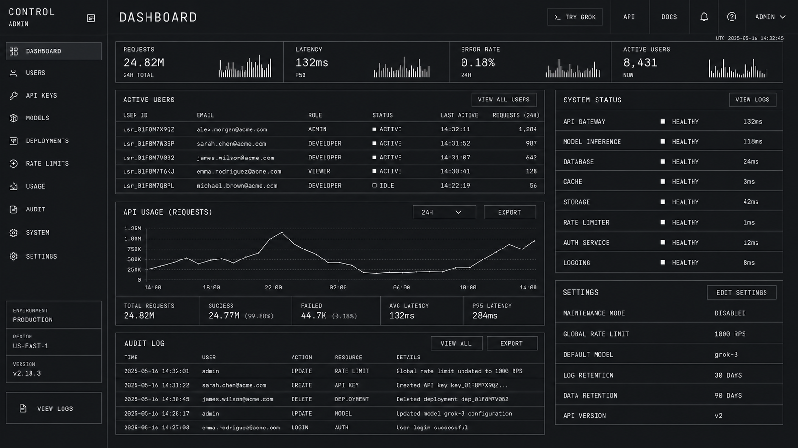

# 受 xAI 启发的设计系统

## 1. 视觉主题与氛围

xAI 的网站是深色优先、等宽字体驱动、粗粝极简主义的典型案例。它给人的感觉像是由真正理解“克制即高级”的工程师构建出来的系统。整个体验以近黑色背景（`#1f2228`）和纯白文字（`#ffffff`）为核心，形成高对比度、终端感强烈的视觉语言，传达出深度技术可信度。没有渐变、没有装饰性插画，也没有争夺注意力的色彩点缀。它通过“缺席”来表达。

字体系统由两种角色清晰的字体构成。`GeistMono`（Vercel 的等宽字体）负责展示级标题，字号可达到惊人的 `320px`，字重为 `300`；同时它也用于按钮字体，采用全大写与 `1.4px` 字间距。`universalSans` 则用于正文与二级标题，以干净、几何化的无衬线风格承担信息阅读。将等宽字体用于展示级文字，是这个系统最具辨识度的决策——它让 xAI 看起来不像消费级产品，而更像基础设施，像是由长期生活在终端中的人构建出来的东西。

间距系统基于 `8px` 网格，取值集中在较小的尺度上（`4px`、`8px`、`24px`、`48px`），体现出一种高密度、信息导向的布局哲学。圆角极少使用，几乎所有元素都保持锐利的建筑感边缘。系统没有装饰性阴影、没有渐变、没有分层式的拟物高度。深度完全通过对比度与留白来表达。

**关键特征：**

- 纯深色主题：`#1f2228` 背景搭配 `#ffffff` 文字，没有中间灰度干扰
- `GeistMono` 用于极大展示字号（`320px`，字重 `300`）：等宽字体即高级感
- 按钮使用全大写等宽字体，并设置 `1.4px` 字间距：技术化、命令式
- `universalSans` 用于正文（`16px / 1.5`）与标题（`30px / 1.2`）：形成干净对比
- 零装饰元素：无阴影、无渐变、无彩色强调
- 基于 `8px` 的稀疏间距系统
- 使用 Heroicons SVG 图标系统：极简、功能化
- 使用 Tailwind CSS 与任意值：工程化的工具优先方式

## 2. 色彩体系与角色

### Primary / 主色

- **纯白**（`#ffffff`）：唯一的文字色、链接色与前景元素颜色。在 xAI 的系统中，白色不是背景，而是声音。
- **深色背景**（`#1f2228`）：整体画布。它是一种带有轻微蓝色底调的暖近黑色，不是纯黑，也不是中性灰。这个色值避免了 `#000000` 带来的强烈视觉疲劳，同时仍保持足够深的暗色感。

### Interactive / 交互色

- **默认白色**（`#ffffff`）：链接与交互元素的默认状态。
- **弱化白色**（`rgba(255, 255, 255, 0.5)`）：链接悬停状态。它不是变亮，而是主动变暗，这一点很反常规，也很有辨识度。
- **微弱白色**（`rgba(255, 255, 255, 0.2)`）：边框、分割线与细微表面处理。
- **焦点蓝**（`rgb(59, 130, 246) / 0.5`）：Tailwind 默认焦点环颜色（`--tw-ring-color`），用于键盘可访问性的焦点状态。

### Surface & Borders / 表面与边框

- **提升表面**（`rgba(255, 255, 255, 0.05)`）：细微卡片背景与悬停表面，几乎不可察觉的层级。
- **悬停表面**（`rgba(255, 255, 255, 0.08)`）：交互容器悬停时更明显一点的背景。
- **默认边框**（`rgba(255, 255, 255, 0.1)`）：卡片、分割线与容器的标准边框。
- **强调边框**（`rgba(255, 255, 255, 0.2)`）：用于激活状态与按钮描边。

### Functional / 功能色

- **主文字**（`#ffffff`）：所有标题、正文、标签。
- **次级文字**（`rgba(255, 255, 255, 0.7)`）：说明文本、注释、辅助信息。
- **三级文字**（`rgba(255, 255, 255, 0.5)`）：弱化标签、占位文字、时间戳。
- **四级文字**（`rgba(255, 255, 255, 0.3)`）：禁用文字与非常细微的注释。

## 3. 字体规则

### 字体族

- **展示 / 按钮**：`GeistMono`，回退字体：`ui-monospace, SFMono-Regular, Roboto Mono, Menlo, Monaco, Liberation Mono, DejaVu Sans Mono, Courier New`
- **正文 / 标题**：`universalSans`，回退字体：`universalSans Fallback`

### 层级

| 角色 | 字体 | 字号 | 字重 | 行高 | 字间距 | 转换 | 说明 |
|---|---|---:|---:|---:|---|---|---|
| 展示级 Hero | GeistMono | `320px`（`20rem`） | 300 | 1.50 | normal | none | 极限尺度，等宽字体高级感 |
| 区块标题 | universalSans | `30px`（`1.88rem`） | 400 | 1.20（紧凑） | normal | none | 干净的无衬线对比 |
| 正文 | universalSans | `16px`（`1rem`） | 400 | 1.50 | normal | none | 标准阅读文字 |
| 按钮 | GeistMono | `14px`（`0.88rem`） | 400 | 1.43 | `1.4px` | uppercase | 拉开字距的等宽字体，命令式 |
| 标签 / 注释 | universalSans | `14px`（`0.88rem`） | 400 | 1.50 | normal | none | 辅助文本 |
| 小号 / 元信息 | universalSans | `12px`（`0.75rem`） | 400 | 1.50 | normal | none | 时间戳、脚注 |

### 原则

- **等宽字体作为展示字体**：`GeistMono` 的 `320px` 使用不是噱头，而是品牌表达。固定宽度字符在极大尺寸下形成一种有节奏的建筑感，这是比例字体难以做到的。
- **大字号使用轻字重**：`320px` 标题使用 `300` 字重，避免等宽字体在极大尺寸下显得沉重或粗暴，使其呈现精密感，而不是压迫感。
- **按钮全大写**：所有按钮文字使用全大写 `GeistMono`，并设置 `1.4px` 字间距。这会形成明确的技术感与近似命令行的交互气质。
- **正文使用无衬线字体**：`universalSans` 以 `16px / 1.5` 提供良好的可读性，并与展示级等宽字体形成清晰对比。
- **两套字体，职责清晰**：系统只使用两种字体，并分工明确：等宽字体用于冲击力与交互，无衬线字体用于信息与阅读。无重叠，无歧义。

## 4. 组件样式

### Buttons / 按钮

#### Primary / 主按钮（深色上的白色按钮）

- 背景：`#ffffff`
- 文字：`#1f2228`
- 内边距：`12px 24px`
- 圆角：`0px`（锐利边角）
- 字体：`GeistMono`，`14px`，字重 `400`，全大写，字间距 `1.4px`
- 悬停：背景变为 `rgba(255, 255, 255, 0.9)`
- 用途：主 CTA，例如 `TRY GROK`、`GET STARTED`

#### Ghost / Outlined / 幽灵按钮或描边按钮

- 背景：透明
- 文字：`#ffffff`
- 内边距：`12px 24px`
- 圆角：`0px`
- 边框：`1px solid rgba(255, 255, 255, 0.2)`
- 字体：`GeistMono`，`14px`，字重 `400`，全大写，字间距 `1.4px`
- 悬停：背景变为 `rgba(255, 255, 255, 0.05)`
- 用途：次级操作，例如 `LEARN MORE`、`VIEW API`

#### Text Link / 文本链接

- 背景：无
- 文字：`#ffffff`
- 字体：`universalSans`，`16px`，字重 `400`
- 悬停：`rgba(255, 255, 255, 0.5)`，即悬停时变暗
- 用途：内联链接、导航项

### Cards & Containers / 卡片与容器

- 背景：`rgba(255, 255, 255, 0.03)` 或透明
- 边框：`1px solid rgba(255, 255, 255, 0.1)`
- 圆角：`0px`（锐利）或 `4px`（细微柔化）
- 阴影：无，xAI 不使用盒阴影
- 悬停：边框变化为 `rgba(255, 255, 255, 0.2)`

### Navigation / 导航

- 背景与页面一致：`#1f2228`
- 品牌字标：白色文字，左对齐
- 链接：`universalSans`，`14px`，字重 `400`，文字 `#ffffff`
- 悬停：文字变为 `rgba(255, 255, 255, 0.5)`
- CTA：白色主按钮，右对齐
- 移动端：汉堡菜单切换

### Badges / Tags / 徽章与标签

#### Monospace Tag / 等宽标签

- 背景：透明
- 文字：`#ffffff`
- 内边距：`4px 8px`
- 边框：`1px solid rgba(255, 255, 255, 0.2)`
- 圆角：`0px`
- 字体：`GeistMono`，`12px`，全大写，字间距 `1px`

### Inputs & Forms / 输入框与表单

- 背景：透明或 `rgba(255, 255, 255, 0.05)`
- 边框：`1px solid rgba(255, 255, 255, 0.2)`
- 圆角：`0px`
- 焦点：使用 `rgb(59, 130, 246) / 0.5` 焦点环
- 文字：`#ffffff`
- 占位文字：`rgba(255, 255, 255, 0.3)`
- 标签：`rgba(255, 255, 255, 0.7)`，`universalSans`，`14px`

## 5. 布局原则

### Spacing System / 间距系统

- 基础单位：`8px`
- 尺度：`4px`、`8px`、`24px`、`48px`
- 间距尺度刻意保持稀疏。xAI 避免细碎的间距差异，而偏好通过明显的尺寸跳跃，用留白直接建立视觉层级。

### Grid & Container / 网格与容器

- 最大内容宽度：约 `1200px`
- Hero：全视口高度，搭配巨大的居中等宽标题
- 功能区块：简单纵向堆叠，区块内边距充足（`48px` 至 `96px`）
- 桌面端使用两栏布局展示功能说明
- 全宽深色区块贯穿全站，保持单一深色背景

### Whitespace Philosophy / 留白哲学

- **极度慷慨**：xAI 使用大量留白。`320px` 标题配合 `48px+` 的周边间距，让空旷感本身成为设计表达——内容足够重要，所以需要空间。
- **垂直节奏优先于横向密度**：内容以较大间隔纵向堆叠，而不是横向塞满。这会产生一种滚动驱动的体验，显得克制、清晰、电影化。
- **没有视觉噪声**：没有装饰元素、没有区块之间的复杂边界，也没有色彩变化。留白成为主要结构工具。

### Breakpoints / 断点

- `2000px`
- `1536px`
- `1280px`
- `1024px`
- `1000px`
- `768px`
- `640px`

使用 Tailwind 响应式修饰符驱动断点行为。

### Border Radius Scale / 圆角尺度

- 锐利（`0px`）：按钮、卡片、输入框的主要处理方式，也是默认方式
- 细微（`4px`）：偶尔用于次级容器的轻微柔化
- 近乎零圆角是品牌粗粝精确感的核心

## 6. 深度与层级

| 层级 | 处理方式 | 用途 |
|---|---|---|
| Flat / Level 0 | 无阴影、无边框 | 页面背景、正文内容 |
| Surface / Level 1 | `rgba(255,255,255,0.03)` 背景 | 细微卡片表面 |
| Bordered / Level 2 | `1px solid rgba(255,255,255,0.1)` 边框 | 卡片、容器、分割线 |
| Active / Level 3 | `1px solid rgba(255,255,255,0.2)` 边框 | 悬停状态、激活元素 |
| Focus / Accessibility | 使用 `rgb(59,130,246)/0.5` 焦点环 | 键盘焦点指示 |

**层级哲学：** xAI 完全拒绝传统基于阴影的层级系统。网站中没有任何盒阴影。深度通过三种机制表达：

1. 基于透明度的边框在交互时变亮，形成元素“被激活”的感觉，而不是“浮起来”的感觉；
2. 极细微的背景透明度变化（从 `0.03` 到 `0.08`）创造几乎不可察觉的表面差异；
3. `320px` 展示级字体与 `16px` 正文之间的巨大尺度对比，形成字体层面的深度。

这是通过对比与透明度构建的层级，而不是通过模拟光影构建的层级。

## 7. Do's and Don'ts / 应做与禁忌

### Do / 应做

- 使用 `#1f2228` 作为全局背景，不要使用纯黑 `#000000`
- 使用 `GeistMono` 承担所有展示级标题与按钮文字，等宽字体就是品牌语言
- 所有按钮标签都使用全大写与 `1.4px` 字间距
- 超大展示标题（`320px`）使用 `300` 字重
- 边框保持在 `rgba(255, 255, 255, 0.1)`，要几乎不可见，但不能完全没有
- 交互元素悬停时变暗到 `rgba(255, 255, 255, 0.5)`，反常规但有辨识度
- 默认保持锐利边角（`0px` 圆角），体现粗粝精确感
- 正文使用 `universalSans`，`16px / 1.5`，保证阅读舒适

### Don't / 禁忌

- 不要使用盒阴影，xAI 的层级系统不依赖阴影
- 不要引入白色与深色背景之外的彩色强调，单色体系是核心
- 不要使用大圆角（`8px+`）或胶囊形按钮，锐利边缘是刻意设计
- 不要给标题使用粗字重（`600–700`），标题字重应保持在 `300–400`
- 不要在悬停时让元素变亮，xAI 的交互逻辑是变暗到 `0.5` 透明度
- 不要添加装饰性渐变、插画或彩色块
- 不要给按钮使用比例字体，按钮必须使用全大写 `GeistMono`
- 除非功能绝对必要，不要使用彩色状态指示器，尽量维持白色 / 深色光谱

## 8. 响应式行为

### Breakpoints / 断点

| 名称 | 宽度 | 关键变化 |
|---|---:|---|
| Mobile / 移动端 | `<640px` | 单列布局，Hero 标题大幅缩小 |
| Small Tablet / 小平板 | `640–768px` | 内边距略微增加 |
| Tablet / 平板 | `768–1024px` | 开始启用两栏布局，标题尺寸增加 |
| Desktop / 桌面 | `1024–1280px` | 完整布局，留白充足 |
| Large / 大屏 | `1280–1536px` | 更宽容器，更多呼吸感 |
| Extra Large / 超大屏 | `1536–2000px` | 最大内容宽度，居中布局 |
| Ultra / 超宽屏 | `>2000px` | 内容保持居中，两侧留出巨大边距 |

### Touch Targets / 触控目标

- 按钮使用 `12px 24px` 内边距，保证触控舒适
- 导航链接之间使用 `24px` 间隔
- 最小点击目标高度：`44px`
- 移动端按钮采用全宽布局，方便拇指点击

### Collapsing Strategy / 折叠策略

- Hero：`320px` 等宽标题在移动端大幅缩小至约 `48px–64px`
- 导航：水平链接折叠为汉堡菜单
- 功能区块：两栏布局折叠为单列堆叠
- 区块内边距：根据屏幕尺寸从 `96px` 逐步降至 `48px`、`24px`
- 超大展示字体是最先需要缩放的元素，必须保持冲击力，但不能溢出屏幕

### Image Behavior / 图片行为

- 尽量少用图片，网站主要依赖字体与留白
- 所有产品截图保持锐利边角
- 全宽媒体应随视口等比例缩放

## 9. Agent Prompt Guide / 代理提示词指南

### Quick Color Reference / 快速颜色参考

- 背景：深色（`#1f2228`）
- 主文字：白色（`#ffffff`）
- 次级文字：白色 70%（`rgba(255, 255, 255, 0.7)`）
- 弱化文字：白色 50%（`rgba(255, 255, 255, 0.5)`）
- 禁用文字：白色 30%（`rgba(255, 255, 255, 0.3)`）
- 默认边框：白色 10%（`rgba(255, 255, 255, 0.1)`）
- 强调边框：白色 20%（`rgba(255, 255, 255, 0.2)`）
- 微弱表面：白色 3%（`rgba(255, 255, 255, 0.03)`）
- 悬停表面：白色 8%（`rgba(255, 255, 255, 0.08)`）
- 焦点环：蓝色（`rgb(59, 130, 246)`，50% 透明度）
- 主按钮背景：白色（`#ffffff`），文字为深色（`#1f2228`）

### Example Component Prompts / 示例组件提示词

- “创建一个 Hero 区块，背景为 `#1f2228`。标题使用 `GeistMono`，`72px`，字重 `300`，颜色 `#ffffff`，居中。副标题使用 `universalSans`，`18px`，字重 `400`，颜色 `rgba(255,255,255,0.7)`，最大宽度 `600px` 并居中。两个按钮：主按钮为白色背景、`#1f2228` 文字、`0px` 圆角、`GeistMono` `14px` 全大写、`1.4px` 字间距、`12px 24px` 内边距；幽灵按钮为透明背景、`1px solid rgba(255,255,255,0.2)` 边框、白色文字，并使用相同字体处理。”
- “设计一张卡片：背景透明或 `rgba(255,255,255,0.03)`，边框为 `1px solid rgba(255,255,255,0.1)`，圆角 `0px`，内边距 `24px`，无阴影。标题使用 `universalSans`，`22px`，字重 `400`，颜色 `#ffffff`。正文使用 `universalSans`，`16px`，字重 `400`，颜色 `rgba(255,255,255,0.7)`，行高 `1.5`。悬停时边框变为 `rgba(255,255,255,0.2)`。”
- “构建导航栏：背景为 `#1f2228`，全宽。品牌文字左对齐，使用 `GeistMono` `14px` 全大写。链接使用 `universalSans` `14px`，颜色 `#ffffff`，悬停时变为 `rgba(255,255,255,0.5)`。右侧放置白色主按钮，按钮使用 `GeistMono` `14px` 全大写与 `1.4px` 字间距。”
- “创建一个表单：深色背景 `#1f2228`。标签使用 `universalSans` `14px`，颜色 `rgba(255,255,255,0.7)`。输入框使用透明背景，边框为 `1px solid rgba(255,255,255,0.2)`，圆角 `0px`，文字为白色 `16px universalSans`。焦点状态使用蓝色焦点环 `rgb(59,130,246)/0.5`。占位文字使用 `rgba(255,255,255,0.3)`。”
- “设计一个等宽标签 / 徽章：透明背景，`1px solid rgba(255,255,255,0.2)` 边框，`0px` 圆角，`GeistMono` `12px` 全大写，`1px` 字间距，白色文字，`4px 8px` 内边距。”

### Iteration Guide / 迭代指南

1. 始终从 `#1f2228` 背景开始，不要使用纯黑或普通灰色背景。
2. `GeistMono` 用于展示与按钮，`universalSans` 用于其他所有内容，不要混用角色。
3. 所有按钮必须使用全大写 `GeistMono`，并设置 `1.4px` 字间距，这是不可妥协的规则。
4. 永远不要使用阴影，深度只来自边框透明度与背景透明度。
5. 边框始终使用低透明度白色，默认 `0.1`，强调状态 `0.2`。
6. 悬停行为应变暗到 `0.5` 透明度，而不是变亮，这与多数系统相反。
7. 默认使用锐利边角（`0px`），只有特定次级容器可以使用 `4px`。
8. 正文使用 `16px universalSans` 与 `1.5` 行高，保证阅读舒适。
9. 区块内边距保持充足（`48px–96px`），让内容在黑暗中有呼吸感。
10. 单色的白色 / 深色背景体系是绝对规则，除非功能关键，否则不要添加色彩。
